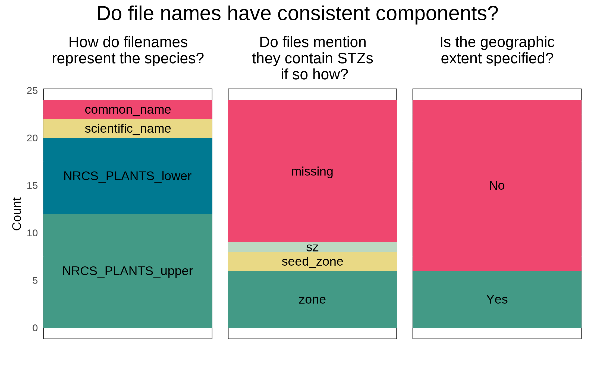
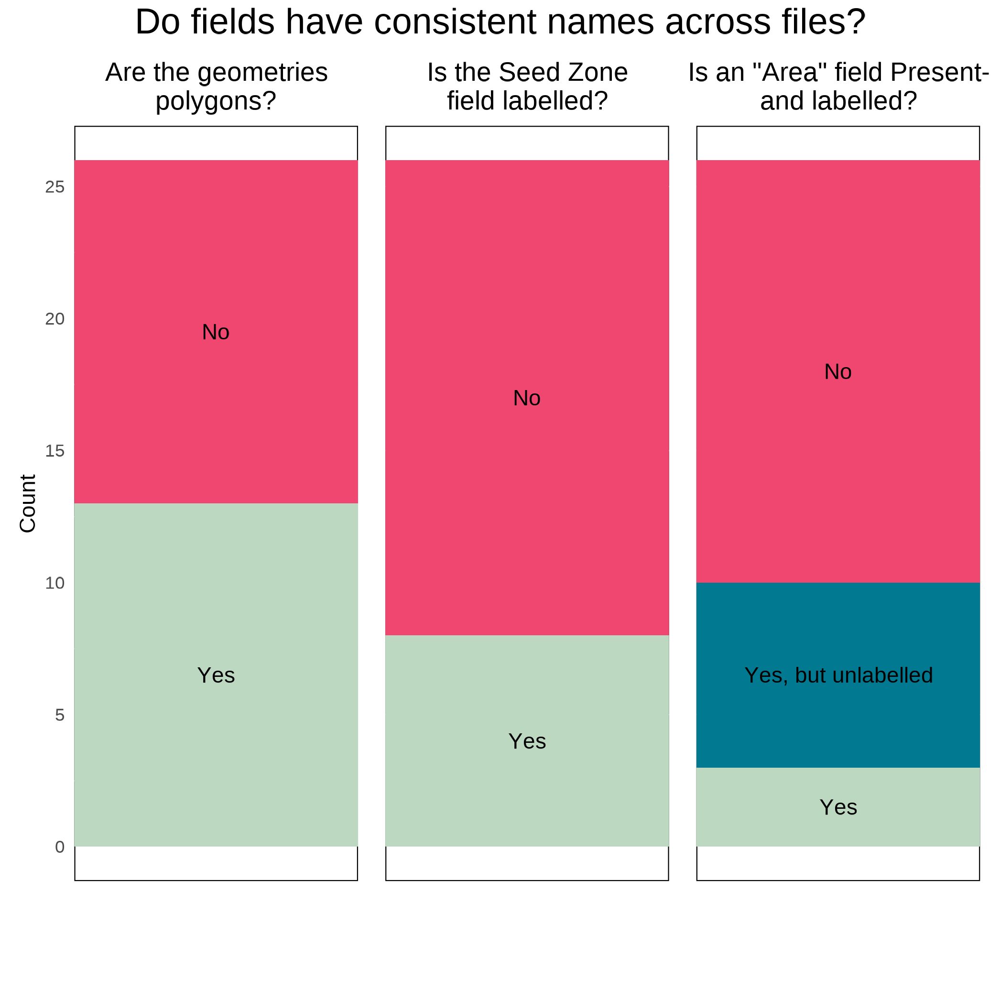
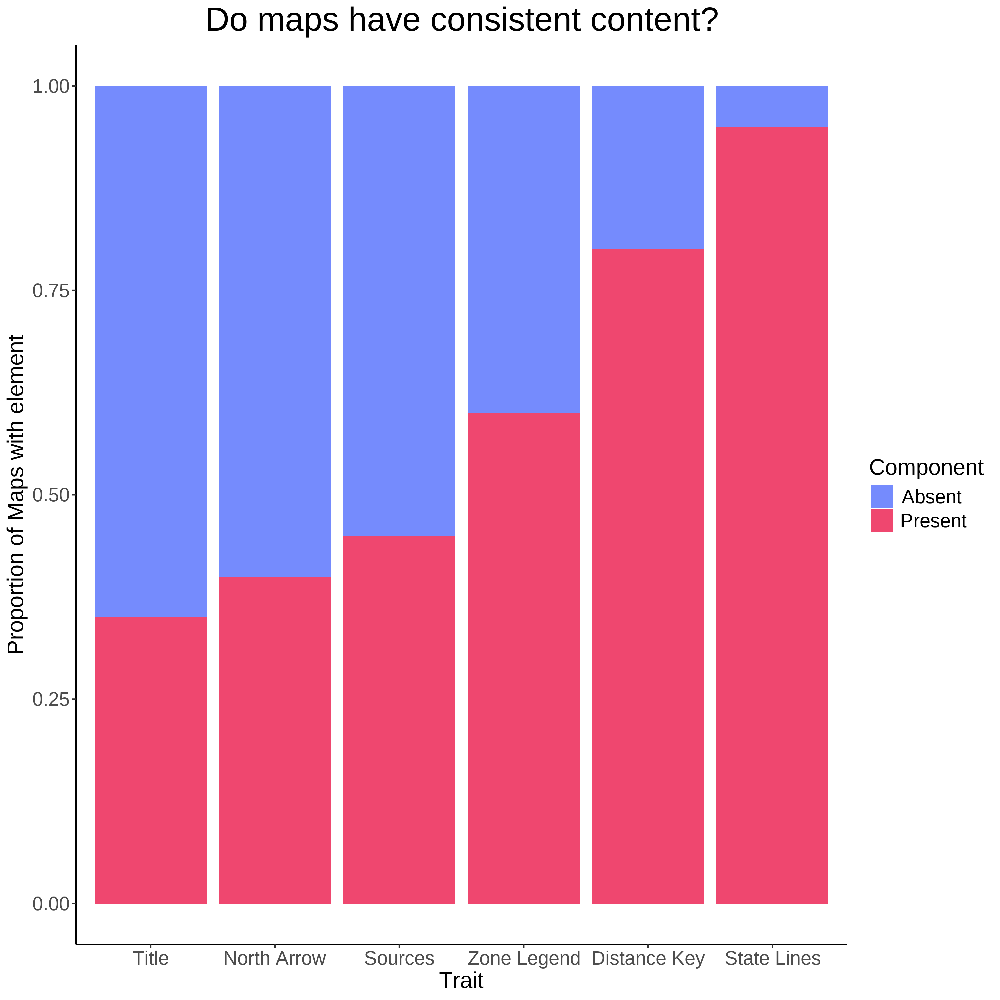
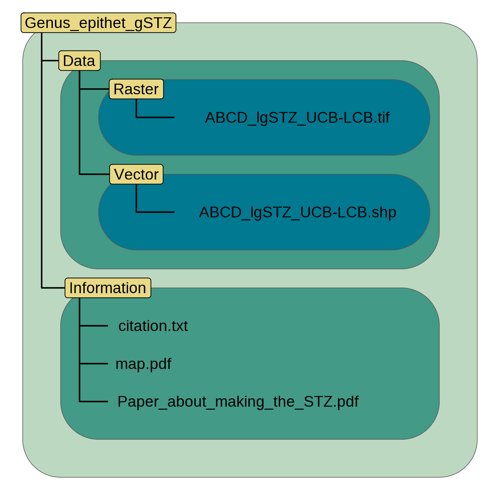
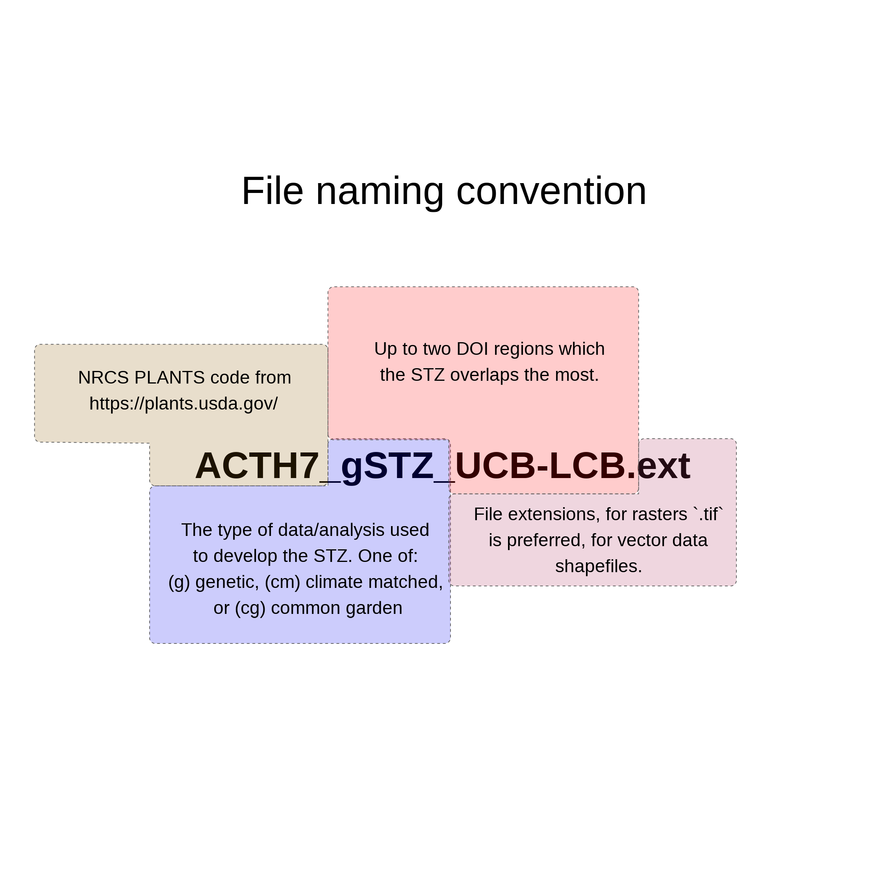
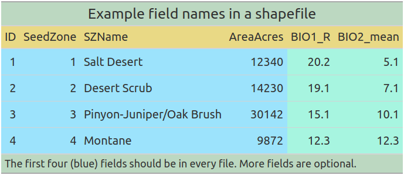

# Abstract

# Introduction

Current estimates suggest that 45% of flowering plant species are at risk of extinction [@bachman2024extinct; @isbell2023expert].
Two growing responses to mitigate the loss of taxonomic and genetic diversity include habitat restoration for *in situ* conservation and the collection and storage of plant germplasm in *ex situ* collections [@heywood2017plant; @volis2010quasi; @westwood2021botanic]. 
Ecological restoration has become a tool to enhance habitat quality in natural areas or to convert land back to natural areas to provide connectivity between remnant parcels, helping to preserve plant and other biodiversity *in situ* [@gann2019international].
Long-term *ex situ* conservation is used when a species has, or is expected to experience, the loss or degradation of its habitat beneath thresholds that can support the species persistence in the wild [@mounce2017ex; @union2012integrated].
However, analogously to *ex situ* conservation - albeit on a different time scale, the development of native plant propagules for ecological restoration requires the collection, and agricultural amplification of germplasm to meet the volumes required for use in restortaion projects [SHRIVER et al. 2026; @wambugu2023role]. 

Central to attaining germplasm collections is the acquisition of adequate amounts of genetic diversity for a portion of the species range for *in situ* restoration or of the entire species for *ex situ*  conservation [@walters2021unique; SHRIVER et al 2026]. 
Approaches for collecting germplasm from wild species for *in situ* restoration projects and *ex situ* in use by the nearly 1750 seed banks globally often follow a set of minimal rule-of-thumb guidelines developed from agricultural and population genetics studies [@hay2013advances; @westwood2021botanic]. 
Currently, guidance exists for conservation and *in situ* restoration projects, the number of propagules that can be collected to safeguard the persistence of natural populations (i.e., avoid over-harvesting), the minimum number of individuals that need to be sampled per population, and the number of populations to sample per species to reach genetic diversity targets [@basey2015producing; @nevill2018ethical].
AND guidance on the geographic structure of where to move restoration collections to and from to avoid using maladapted phenotypes at a restoration site [@vander2010question, CITE].
However, a variety of goals exist at the institutional, programmatic, and bio-regional organizational levels, as well as opinions among curators, which have fostered tailored strategies beyond rule-of-thumb guidelines [@guerrant2014sampling].
Furthermore, these minimal guidelines do not guarantee alignment or achievement of goals for all observed species and population genetic structures or population vital rates because of nuances in the biology and ecology of individual species [@bucharova2025assessing; @hofner2025spatial; @hoban2020taxonomic; @whitlock2016consequences]. 

However, the germplasm collections desired for ecological restoration and *ex situ* conservation differ in a key attribute. 
Restoration collections seek to maximize the likelihood of restoration success at sites in a defined focal area and time and seek to identify populations with the highest chance of doing so while maintaining some allelic diversity for at site selection [@johnson2010best].   
*Ex situ* germplasm collections, on the other hand, aim to maximize coverage of neutral genetic variation, the material which allows evolution a wide array of phenotypes to act upon, following the logic that no set of phenotypes are universally most fit, and the long term persistence of the species will require a wide base of standing diversity for selection to act upon. 

Here, we present two geospatial software packages to help curators refine and implement their collection goals - using free and open-source software (FOSS) developed in the R programming language, and requiring minimal familiarity with R to use. 
The first tool, `safeHavens` (https://sagesteppe.github.io/safeHavens/), which is global in coverage, aims to maximize the putative coverage of neutral genetic variation across the entirety, or subsets of, a species range using proxies: 1) geographic, 2) ecoregional, and 3) environmental coverage of *ex situ* and restoration collections in areas lacking defined seed transfer zones, or in scenarios where seed transfer zones may not align with the goals of restoration collections.
The second tool, tailored to the Western United States - but globally applicable, `eSTZwriter` (https://sagesteppe.github.io/eSTZwritR/) assists quantitative geneticists in producing standardized spatial data products describing areas for targeted seed collection and restoration planing, which may be readily used by curators.  

 (@havens2015seed)

![Dissemination, proceeding clockwise from 'Collections'. The first phase of collections includes the initial collection of germplasm from the wild, the most common starting point for both restoration and *ex situ* conservation.  The next two panels *largely* refer to quantitative genetics approaches for the development of empirical seed transfer zones, while 'Dissemination` depicts the essential component for developing a curated collection of being able to convey priority areas to collector crews for a more targeted collection. These activities lead to the potential for agricultural or propagation increase of collected germplasm and the selection of materials for restoration plantings. By Emily Woodworth.](./figures/Wu-naut.jpg){width=75%}  

# safeHavens

While accessioning and maintaining germplasm collections *ex situ* to develop propagules are cost efficient restoration conservation activities, the field work required to acquire even a minimal number of populations, and individuals from them, across a species range remains costly.
Notable costs include the wages for field staff to perform the germplasm collection, and fuel to visit sites - generally repeatedly - to assess the size of the population, and conduct sampling at phenologically appropriate times. 

Endeavors to maximize the representation of adaptive potential and neutral genetic diversity requires minimizing the cost of variable field expenditures to distribute project funds across as broad a range of species as can be afforded. 
To this end we have developed a variety of tools which are useful for partitioning the geographic, and environmental, space which species occupy to develop priority zones and spatial products which can be used to prioritize and communicate areas of interest to field crews. 

The R package `safeHavens` provides functionality to partition species ranges into geographically constrained clusters by utilizing three types of distances: geographic, environmental, or resistance to movement, that have been empirically shown to restrict genetic connectivity in plants. 
These groups form identifiable units that can be used for designing germplasm collection endeavors, assigning a desired number of target samples to each cluster, and optionally return spatial data for sending to field crews to guide collections. 

## Usage

All functions require species occurrence data, such as from GBIF, and readily available and easy to integrate into usage with `safeHavens` through the `rgbif` package, although taxa requiring enhanced cleaning may require the use of gatoRs [@chamberlain2017rgbif; @patten2024gators]. 
Given the relatively coarse nature of these analyses GBIF data should be sufficient for all taxa less rare species, which are likely to require data maintained by administrative bodies responsible for the management of rare species (e.g. NatureServe members, or in the United States various state and federal agencies). 
A mid-grade personal laptop is sufficient to carry out spatial analyses, and the the compute time to treat a thousand species should only be on the order of a day for the most complex approaches (REED, ACTUALLY SIMULATE THIS WITH ~100 TAXA), no paid data sources or software are required, and minimal knowledge of R should be sufficient. 

Functions that utilize purely geographic distance include: `PointBasedSample`, `EqualAreaSample` and `IBDBasedSample`, as well as a `OpportunisticSample` which uses geography but existing collections and designs future collections around them. GENERAL OVERVIEW - 2 SENTENCES. 
A general vignette on the package, which covers these functions is available at [Getting Started](https://sagesteppe.github.io/safeHavens/articles/GettingStarted.html). 

Environmental distance, relevant to the biology of individual species, is accomodated by `EnvironmentalBasedSample`, and its data preparation helpers: `elasticSDM`, `PostProcessSDM`, `RescaleRasters`, `writeSDMResults`. GENERAL OVERVIEW - 2 SENTENCES. 
a vignette is available [Species Distribution Models](https://sagesteppe.github.io/safeHavens/articles/SpeciesDistributionModels.html)

Resistance to geneflow is addressed by the function `IBRSurface` and its data preparation helpers: `buildResistanceSurface`, `populationResistance`, and requires the final sample draw to be generated using `PolygonBasedSample`. 
The isolation by resistance workflow creates a *theoretical* surface, populated with user specified values, that represents the cost to movement of genetic material (e.g. fruits and seeds, and pollen) between populations. 
A single surface can be used for a landscape, or surfaces can be parameterized for individual species. 
However, given a lack of detailed knowledge on the dispersal ecology of many species, and in the absence of genetics data, we expect generalized surfaces for landscapes, rather than species interactions with landscape, to be the most often used.
A vignette covering the preparation of surfaces is available at [Isolation by Resistance](https://sagesteppe.github.io/safeHavens/articles/IsolationByResistance.html). 

The function `PolygonBasedSample` works on either provisional or empirical seed transfer zones, ecoregion level data, and is required to finish a sample design under isolation by resistance based sampling. 
`PolygonBasedSample` is able to incorporate multiple user specified decisions to maximize sample numbers in various strata based on their size, number of disconnected areas, or - when the data are available, temperature. 
Accordingly, it can loosely accomodate the variables that went into the generation of seed transfer zones or ecoregions. 

Additionally, a function for sampling rare species based on occurrence data `KMedoidsBasedSample` is included, which can run on either geographic or environmental data, and allows for boostrap permutations around taxonomic, coordinate, and whether a population is still extent, uncertainty. GENERAL OVERVIEW - 2 SENTENCES. 
A vignette is available [Rare Species](https://sagesteppe.github.io/safeHavens/articles/RareSpecies.html)

A final function, that exists for creating cartographic boundaries to for use with mobile GIS software is `PrioritizeSample`, which creates concentric rings around the center of each sampling unit to try and guide collectors towards center regions of collection zones rather than extremes. 
It is detailed only in a vignette that emulates the total process of designing an actual sample design for species in [Worked Example](https://sagesteppe.github.io/safeHavens/articles/WorkedExample.html). 

## Detailed Functionality 

Three sampling approaches offered by `safeHavens` are relatively complex and their general workflows are described below. 

------------------------------------

`KMedoidsBasedSample` the sole function intended for use with rare species simulates both geographic and taxonomic uncertainty of cleaned population occurrences to identify a core number of populations that best minimize the sum of square distances between medoid cluster membership. 

To conduct `KMedoidsBasedSample` the function does this... 

1) Identify sites that will be permuted via coordinate jittering, or population dropout. 
2) For n simulations jitter sites X times, updating distance matrices only where relevant
3) Perform k-medoids sampling across the existing network
        Calculate cost of each solution, by minimizing sum of squares differences between cluster medoid and sites
        Repeat k-medoids sampling X times to see if it can be improved, return least cost solution. 
4) From all bootstrap solutions, identify the site pair group that’s are returned most often (co-occurrence strength), and rank a relative order of site visitations. 

------------------------------------

The isolation by resistance workflow separates the creation of the resistance surface (`buildResistanceSurface`), assignment of areas of species occurrence `populationResistance`, and actual sampling (using `PolygonBasedSample`), into distinct phases allowing the user to interact with intermediate outputs. 

1) Parameterize a cost surface (raster) using environmental variables that restrict species gene flow, using  `buildResistanceSurface`, or the user can build and supply there own surface. 
1.5) Calculate least distance costs between randomly sampled cells in areas buffered around existing collections `populationResistance` that will be used for the distance matrix.  

`IBRSurface` will perform the following steps before returning a product that the user can submit to sampling with `PolygonBasedSample`. 

2) Identify *n* clusters of areas with less resistance to dispersal within them, using the IBR distance matrix, and NbClust with complete linkage for a full matrix, or by ordinating a delaunay graph (sparse) distance matrix into two-dimensional space before applying NbClust. 
3) Identify the shortest geographic distance between any two sampled points in different clusters, and use 45% of the minimum distance as a buffer to assign all pixels surrounding points to the points cluster group. 
4) Expand cluster margins outward in iterative geographic fronts until reaching maximum cell count or encountering cells adjacent to multiple clusters
5) Cells on the boundaries of multiple clusters, are split relatively evenly in linear features towards adjacent clusters; any remaining points are randomly assigned to a bordering cluster. 
8) The resulting `sf` object can then be passed to `PolygonBasedSample` and relevant methods dispatched. 

-------------------------------------
to conduct `EnvironmentalBasedSample` the function does this...  

0) Generate psuedo-absences to fit a presence absence model, and thin occurrence records to reduce spatial auto-correlation in areas with higher sampling activity [@naimi2016sdm; @aiello-lammens2015spthin]. 
0.5) Create spatially explicity cross-validation folds, and use recursive feature elimination to identify environmental variables with an association with species occurrence records (CARET-KUHN), generate PCNM eigenvectors and use forward feature selection on a subset of them (e.g. the first 10 or 20) to identify predictors associated with occurrences [@meyer2025cast].
1) Fit a final elastic net SDM with environmental predictors and spatial PCNM eigenvectors to model species distribution [@tay2023elasticnet; @oksanen2025vegan]. 
2) Extract and standardize beta coefficients, then rescale raster layers and weigh by absolute coefficient values. 
2.5) Predict the probability of the taxons occurrence using this model onto a probability surface, and threshold to likely areas [@hijman2026terra; DISMO]. 
3) create a matrix of relevant environmental weights from the environmental matrix, and geographic distances, and use hierarchical clustering to identify environmentally similar and geographically constrained groups of populations. 
4) To create a surface of environmental group classification, train a KNN classifier, if classes are unbalanced retrain a final classifier and predict environmental cluster asignments across the weighted raster surface. 

# eSTZwritR
Empirical seed transfer zones (eSTZs) are gaining popularity among restoration practitioners as tools to identify the most appropriate seed source for a species at a restoration site [@mckay2005local]. 
eSTZs are becoming more widely used for two primary reasons: 1) they are based on empirical data, such as phenotypes in a common garden, and 2) there are generally fewer zones than provisional seed transfer zones, thereby reducing the number of lineages that require cultivation in agricultural settings. 
Although popular, the development of eSTZs for a species is a costly and time-consuming process, most often involving common gardens or genetic studies, with many populations from across the species range incorporated as samples [@kramer2015assessing].   

While practices for developing eSTZs are becoming more defined, to our knowledge, no standards exist for *sharing* eSTZ results (Supplemental 1). 
Although eSTZs are produced by a handful of research of groups, inconsistencies vary across the spatial data products used to report and share eSTZs.

The success of a restoration project relies on the timely application of techniques that are suitable for the site at hand. 
Hence, the dissemination of ideas during and after a restoration project is the best opportunity to improve restoration outcomes (Figure 1). 
However, spatial data are notoriously complex and difficult to transmit, historically requiring specialised software, and spatial data require both written and geographic data (e.g., coordinates and relations between them) in the form of spatial data products (e.g., rasters and shapefiles) to accurately convey their meaning. 
Given the relative complexity of communicating precise spatial information, standards should exist to ensure not only its accuracy and precision but also its ease of interpretation and use. 

## Software

To make these suggestions easy to implement we have created an R package, eSTZwritR (pronounced 'easy rider'), which can implement all of them, less the statistical processing, with minimal user inputs. 
The package is installable from GitHub https://github.com/sagesteppe/eSTZwritR and has a GitHub Pages website (https://sagesteppe.github.io/eSTZwritR/) for users interested in better understanding its functionality, and which includes supplemental figures and details not discussed here. 

The package requires only five functions to produce a directory with the contents discussed above, with minimal data entry. 
Most importantly, the entries are well outlined and easily entered without requiring close attention to detail. 
These results should allow for simple utilization of existing empirical seed-transfer zone resources. 
This software was designed based on a review of the data sets below... 

## Methods 
Using 23 sets of eSTZs produced for 22 taxa, across the western United States, we showed that most of the spatial data developed and disseminated to share the results of an eSTZ are inconsistent (Supplemental 1). 
We have already observed significant hindrances to the uptake of these data at the practitioner level and searched for consensus within these data. 
Subsequently, using any consensus (wisdom of the masses) from these data combined with standard conventions of data sharing, we present a set of guiding standards for researchers in the United States to make the results more consistent.   

We conducted a review of all eSTZs on the Western Wildland Environmental Threat Assessment Center (WWETAC) website as of May 1, 2024 (https://research.fs.usda.gov/pnw/products/dataandtools/datasets/seed-zone-gis-data).
Each data product (file name structure, field naming conventions, and directory structure) was manually scored, and all analyses were performed in R version 4.2.1.

## Results 

{width=50%}  

In Figures 2 through 4, we present inconsistencies that we believe, or have observed, to interfere with practitioners' workflows. 
We encountered considerable inconsistencies within file names (Figure 2), in directory structure and naming (Figure 3), and cartographic elements of the 20 maps available (Figure 4). 
While some consensus existed around the use of USDA NRCS-Plants codes for denoting the taxon contained in the file (Figure 2), the lack of file names mentioning what attribute about the taxon they contained (e.g. 'zones, ' ‘seed_zone, ' ‘sz'), and the lack of specified geographic extents can make determining the specifics of the file difficult unless it is explicitly opened in a Geographic Information System (GIS) software.  

{width=50%}

The naming of the fields (columns) within vector data file presented the most problematic results (Figure 3), here we focus only on three inconsistences. 
Different uses of polygon geometry were implemented to represent the individual seed transfer zones, that is, sometimes all portions of a seed transfer zone, when at least some components are disconnected, where stored within the same object or row (a multipolygon). 
At other times, each discontinuous portion of the range was stored as its own polygon. For most infrequent Geographic Information System (GIS) users, we observed that multipolygons can be confusing and require them to use several moderately advanced spatial techniques to interact with. 
Surprisingly, within each shapefile, the field denoting the seed zones was often ambiguously labelled or entirely lacking any indication (Figure 3).
In several instances, it took several minutes to determine which field was the seed zone by toggling through and visualizing many fields, despite us having already interfaced with all of these products multiple times.  

{width=50%}

## Discussion 

Some consensus exists among eSTZ developers for a range of attributes related to the distribution of data products. 
Combining these opinions with best practices for data sharing and experience as users of each of the existing empirical products results in the following recommendations. 

### Directory Structure
{width=50%}

eSTZs should be distributed using a predictable directory structure that allows users to be immediately familiar with where to find the content (Figure 5). 
We recommend that all directories (folders) have two main subdirectories (Figure 5), one containing the essential data products, preferably in both raster and vector data formats (*see 'Data Formats'*). 
The second directory contains information related to the product, including a formatted citation for data use, a map for quick reference, and any materials describing the development of the product, both as a paper and a text file of quick metadata attributes.  

### File Naming
{width=50%}  

The files within the directory should follow an easily interpretable naming convention  that allows users to import todata various softwares while also describing the essential attributes of the data product. 
We recommend (Figure 6) each file name has three main components. 
The first component is the USDA PLANTS code, and the second is the method used to develop the STZ - currently one of 'g', 'cg', 'cm' (for genetic, common garden, and climate matched, respectively), and the final is up to the two main regions which the product overlaps. 
In the United States, we recommend the use of the 12 Department of Interior regions as they cover contiguous geographic expanses, are few enough to be easily remembered, and balance L2 Omernik ecoregions with easier to remember state lines. 
However, in other nations, the use of ecoregions may be more desirable.  

### Maps 
Maps of the data product should be included in the 'Information' directory. 
Many questions about eSTZs can be answered quickly and simply by a practitioner consulting a map saved as a PDF with the essential cartographic components; fortunately most developers already supply these. 
We recommend that each map contains the following elements: north arrow, scale bar, state borders, geographically relevant cities, coordinate reference system information, sensible categorical color schemes for the seed zones (e.g. from ColorBrewer https://colorbrewer2.org), a legend, the taxons name as a title, and the maps theme ('Seed Transfer Zones') as a subtitle. 

### Data Formats
We recommend that the spatial data associated with an eSTZ be distributed using both popular spatial data models, vector and raster. 
For vector data, we advocate the continued usage of the shapefile format, whereas for raster data, we propose the use of geoTIFFs (‘tifs,’ the. tif extension). 
In our experience, tifs seem to be the most widely used raster data models in ecology for non-time series data, and are supported by effectively all GIS software.   

### Vector Data Field Attributes
{width=50%}  

The order of the fields (or columns) of the vector data should follow a predictable pattern (Figure 7), allowing humans to interact with the data in a graphical user interface (GUI) to quickly detect their field of interest. 

We recommend that each vector file have at least four fields in the following order and of the following data types.
1) The numeric integer (ID) a unique number associated with each individual polygon in the file.    
2) Seed Zone (numeric integer) a unique identifier for each of the eSTZs delineated by the product developers, which allows for quick filtering of the data based on a simple numeric value that is difficult to misspecify.  
3) SZName (character): a human-developed name for the zone that may refer to an axis of a principal component analysis, for example, 'LOW MEDIUM LOW', or be defined by the product developers. We propose that semi-informative names should be developed before data distribution to help practitioners more easily convey important attributes.  
4) AreaAcres (numeric - integer) of each polygon.  

In addition to these standard field naming and placement conventions, we recommend a series of standards for the contents within these essential fields and how to format any additional fields relevant to the project (see package website).  

# Discussion 
Both packages are intended to increase the availability of native germplasm to increase the chances of success for terrestrial restoration and *ex situ* conservation. 
safeHavens supplies curators, and planners, with a set of tools to clearly determine options for specific sampling programs, which may be used for evaluating nad reporting progress towards conservation goals, as well as guiding field sampling activities. 
eSTZwritR helps research groups communicate and share the results of their findings wih germplasm curators and these curators with field crews, and restoration ecologists with loosely determing seed lots although tools such as *Seed Lot Selection tools* and AWESOME SA PAPER are now preferrable for most of these applications.  

Both packages ensure that curators and groups do not require traditionally expensive Geographic Information System software, and are able to be readily modified and extended for various goals and utilities. 

# Author Contributions
R.C.B. conceived of the ideas, developed the software, and wrote the manuscript. 
B.W. contributed to the conceptualization of the eSTZwritR package, and collected all data for analysis of existing eSTZ products, and contributed to writing the manuscript.

# ORCID

Reed Benkendorf https://orcid.org/0000-0003-3110-6687  
Sophie Taddeo https://orcid.org/0000-0002-7789-1417

# Acknowledgements
The Bureau of Land Management for partially funding the developement of these tools through work contracted to the Chicago Botanic Garden.
Emily Woodoworth for creating the 'Dissemination' figure. 

\singlespacing  

# LITERATURE CITED

# FIGURES 

\processdelayedfloats
\clearpage